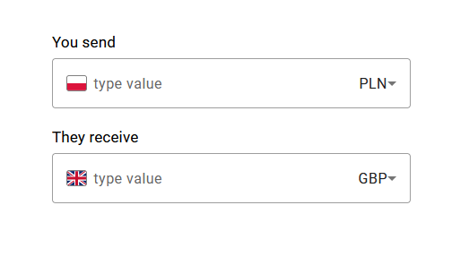
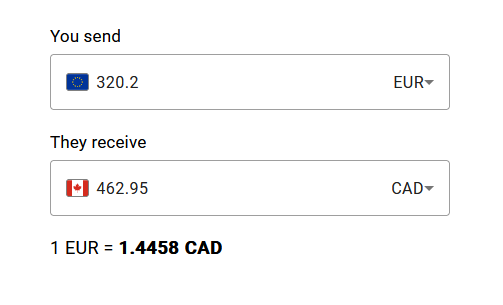
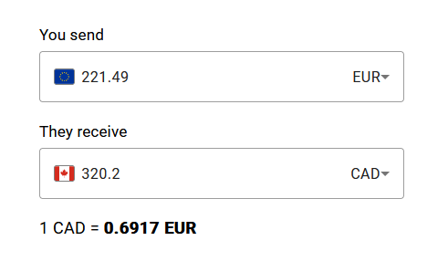
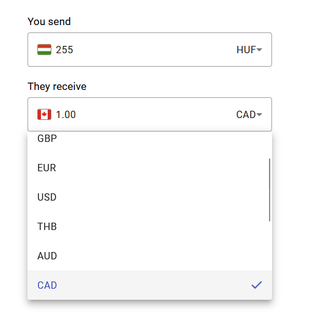

## EXCHANGE CONVERTER APPLICATION

### WYMAGANIA / REQUIREMENTS

- Node.js 18.13.0

- Angular CLI 15.0.5

- Maven 3.9.0

- Java SE  17

### URUCHOMIENIE
- #### INTERFEJS UŻYTKOWNIKA

W folderze `exchange-converter-ui` uruchomić linię poleceń,
następnie wywołać komendę `ng serve`.
Interfejs powinien być dostępny pod
adresem http://localhost:4200/.

- #### SERWER

Folder `exchange-converter` otworzyć w IDE.
Uruchomić kod przy użyciu funkcji `main()`
z klasy `ExchangeApplication`.

Po wykonaniu powyższych kroków aplikacja powinna
działać przy użyciu interfejsu użytkownika.

#### ALTERNATYWNE URUCHOMIENIE

Alternatywne uruchomienie polega na zbudowaniu aplikacji.

W folderze `exchange-converter` uruchomić linię poleceń.
Wywołać komendę `mvn clean install`.
Po prawidłowo zakończonym procesie otworzyć projekt w
IDE i przy użyciu funkcji `main()` uruchomić kod z klasy
`ExchangeApplication`.
Interfejs powinien być dostępny pod
adresem http://localhost:8080/.

### INTERFEJS UŻYTKOWNIKA

Aplikacja przewiduje możliwość przeliczenia walut
w dwie strony – np. z funtów brytyjskich na złotówki
oraz ze złotówek na funty brytyjskie.
W odpowiednie pole należy wpisać wybraną wartość
jako liczbę całkowitą lub zmiennoprzecinkową z dokładnością maksymalnie dwóch
miejsc po przecinku. Maksymalna wartość jaką przyjmuje program to
999999999.99.
Pole formularza reaguje na zmianę
wartości. Przeliczona wartość pojawi się w drugim polu.

Pod polami formularza, wraz z jego pierwszym użyciem,
powinien pojawić się także aktualny kurs waluty którą
przeliczamy. Na przykład: przeliczenie funta brytyjskiego
na złotówki wyświetli wartość 1 funta brytyjskiego
wyrażonego w złotówkach. Wartość kursu podaje się
w pełnej formie, tzn. do czterech miejsc po przecinku.

### APPLICATION START
- #### USER'S INTERFACE

Run commandline in `exchange-converter-ui` directory, then
call `ng serve` command.
Interface should be available at http://localhost:4200/.

- #### SERVER

Open `exchange-converter` in IDE.
Run code with `main()` method
from `ExchangeApplication` class.

After following above steps, application should work
with user's interface.

#### ALTERNATIVE START

Alternative start requires to build application

Run commandline in `exchange-converter` directory.
Call `mvn clean install` command.
After the process is completed correctly, open project
in IDE and run the code with `main()` method from
`ExchangeApplication` class.
Interface should be available at http://localhost:8080/.

### USER'S INTERFACE

The application provides the possibility of currency
conversion in both ways - i.e. from British pounds to Polish
zlotys and from Polish zlotys to British pounds.
Choose which way you want to convert and type value
in as integer or floating point with
accuracy od up to two decimal places. Maximum size of
typed number is 999999999.99. Form field react on value
change. Calculated value will appear in second field.

With first use of form fields, below them should appear
current exchange rate. In example: calculation from
British pounds to Polish zlotys display value of
1 British pound expressed in Polish zlotys. Value
of exchange rate is given in full form, to four decimal
places.

### SCREENSHOTS

